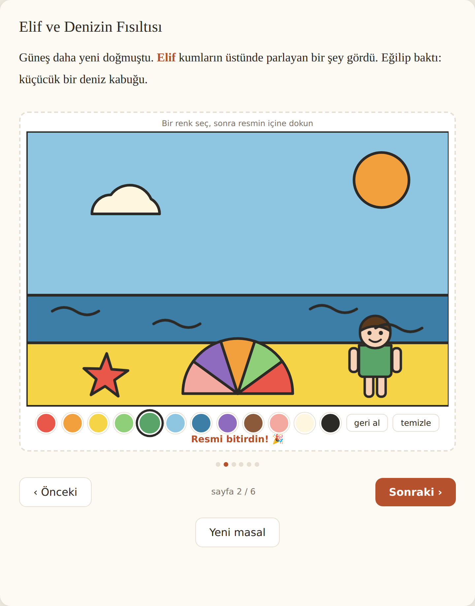

# Masal

Çocuğun adına, yaşına ve şehrine göre yazılan uyku öncesi masalı, **içine
gömülü boyama alanlarıyla** birlikte tarayıcıda okutan web uygulaması.

İndirme yok, PDF yok: hikaye de boyama da uygulamanın içinde kalır.

**Canlı:** <https://furkiozknn.github.io/masal/>



## Ne çalışıyor (8 Eylül 2026)

| | |
|---|---|
| Hikaye üretimi | Şablon motoru — **API anahtarı gerektirmez**, maliyeti sıfır |
| Diller | Türkçe, İngilizce. Açılışta tarayıcı dilinden seçilir, üstten değiştirilebilir |
| Temalar | Deniz, Orman, Yıldızlar, Kar, Yağmur, Bahçe. Her biri 6 sayfa |
| Seçim noktası | Üçüncü sayfada hikaye ikiye ayrılıyor; altı tema × iki yol = on iki okuma |
| Kitaplık | Okunan masallar birikiyor, kaldığı sayfadan devam ediliyor |
| Yaş | Punto ve sesli okuma hızı yaşa göre üç kademe |
| Kapanış | Masal bitince aynı çocuk için okunmamış temalar öneriliyor |
| Kahraman | Çocuk figürü her sahnede görünüyor; ten, saç rengi ve saç tipi seçilebiliyor. Kıyafeti boyanabilir |
| Boyama | Sayfaya gömülü SVG sahne, bölgeye dokununca dolar |
| Hareket | Kar yağıyor, yaprak düşüyor, yıldız parıldıyor, dalga kıpırdıyor — CSS ile, sıfır maliyet. Boyanabilir bölgeler sabit |
| Kayıt | Boyama tarayıcıda saklanır, sayfa yenilense de durur |
| Türkçe ekler | Ünlü uyumu ve sert ünsüz benzeşmesi otomatik (`turkce.js`) |
| Sesli okuma | Tarayıcının konuşma motoru; cihazda o dilde ses yoksa düğme görünmez |
| Erişilebilirlik | Lighthouse mobil: erişilebilirlik, en iyi uygulamalar, SEO ve agentic browsing dördü de 100 |

## Çalıştırma

```
python sunucu.py
```
Sonra `http://127.0.0.1:8790/`. Derleme adımı yok, bağımlılık yok.

`python -m http.server` de çalışır ama **önerilmez**: tarayıcı ES modüllerini
önbelleğe alıyor, dosyayı değiştirip yenileyince eski sürüm çalışıyor ve test
sonuçları yanlış çıkıyor. `sunucu.py` önbelleği kapatıyor.

Test: `node turkce.test.js`, `node hikayeler.test.js`, `node olcum.test.js`

## Neden vektör (SVG) boyama

Rakipler raster (piksel) görsel üretiyor; o görseller ya boyanamıyor ya da
taşarak boyanıyor. Burada her boyanabilir bölge ayrı bir SVG şekli:

- Dokunulan bölge **temiz** dolar, konturun dışına taşmaz.
- Görsel üretim maliyeti **sıfır** — sahneler elle çizilmiş şablon.
- Boyama durumu birkaç yüz bayt; resim değil, bölge→renk eşlemesi saklanıyor.

## Dosyalar

| Dosya | İş |
|---|---|
| `index.html` | İki ekran: form ve okuyucu |
| `app.js` | Durum, sayfa geçişi, dallar, boyama, kitaplık, sesli okuma, dil |
| `hikayeler.js` | Şablon metinler (tr/en) ve doldurma motoru |
| `sahneler.js` | Boyanabilir SVG sahneler: oda, kumsal, orman, uzay, kış, yağmur, bahçe |
| `turkce.js` | Hal eki üretici + `turkce.test.js` (28 durum) |
| `karakter.js` | Kahraman SVG üreteci: ten/saç seçenekleri, saç tipleri |
| `olcum.js` | Ölçüm noktaları + gizlilik süzgeci (`olcum.test.js`) |
| `hikayeler.test.js` | Şablon yapısı: dil/tema eşliği, dal uzunlukları, sahne bütünlüğü, çözülmemiş yer tutucu |
| `sunucu.py` | Geliştirme sunucusu, önbellek kapalı |
| `LICENSE` | MIT |

### Şablonlarda Türkçe ek

Şablona ek elle yazılmaz, yer tutucuyla istenir:

```
{sehir:de}  ->  Trabzon'da / Sinop'ta / İzmir'de
{ad:e}      ->  Elif'e / Ada'ya
{ad:i}      ->  Elif'i / Ada'yı
{sehir:in}  ->  Uşak'ın / kasabanın
```

"Trabzon'de" gibi tek bir hata ürünü anında ucuz gösterdiği için bu kurallar
koda gömülü ve testli.

## Sonraki adımlar

1. **LLM katmanı** — şablon yerine özgün hikaye. Anahtar sunucuda kalmalı,
   tarayıcıya konmaz. Şablon motoru yedek olarak kalır: API düşerse ürün çalışır.
2. **Sahne kütüphanesini büyütmek** — şu an 7 sahne. Hikaye çeşitliliği
   sahne sayısına bağlı.
3. **Ücretlendirme** — Türkiye'den tahsilat için Polar.sh / Lemon Squeezy
   (Stripe ve PayPal Türkiye'de yok).
4. **Ölçüm** — noktalar yerleştirildi (`olcum.js`): masal-uretildi,
   secim-yapildi, boyama-basladi, masal-bitti, kitapliktan-devam. Gönderim ucu
   şu an kapalı, hiçbir istek gitmiyor; yayın çözülünce tek adres yazılacak.
   Çocuğa ait hiçbir bilgi (ad, şehir, boyama) gönderilmiyor, süzgeç testli.

## Bilinen sınırlar

- Şablon hikayeler LLM kadar çeşitli değil. Seçim noktası tema başına iki yol
  veriyor ama olay örgüsü yine sabit.
- Ek motoru "saat'te / kalp'e" gibi ince okunan kalın yazımları bilmez.
- Boyama ve kahramanın görünümü sadece o tarayıcıda durur; cihaz değişince gider.
- Kahramanın görünümü elle seçiliyor. **Fotoğraf yüklenmiyor**: hiçbir görsel
  cihazdan çıkmıyor, saklanmıyor, taranmıyor.
- Sesli okuma cihazın yüklü seslerine bağlı: Türkçe sesi olmayan bir masaüstünde
  düğme hiç çıkmaz. Telefon ve tablette Türkçe ses standart.
