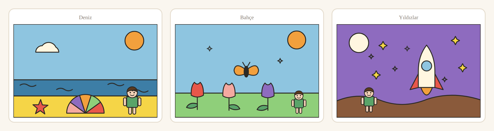

# Masal

[](https://github.com/Furkiozknn/masal/actions/workflows/ci.yml)

Çocuğun **adına, yaşına ve şehrine göre** yazılan uyku öncesi masalı; sayfaların
içine gömülü **boyama alanlarıyla** birlikte tarayıcıda.

Hazır boyama sayfaları çocuğun adını bilmez. Yapay zekânın ürettiği resimler
ise piksel olduğu için boya konturdan taşar. Burada hikaye çocuğun adıyla ve
Türkçe eklerle doğru çekimlenerek (`Trabzon'da`, `Ada'ya`) yazılıyor, resim de
ayrı ayrı SVG bölgelerinden oluşuyor. Bölgeye dokununca yalnızca o bölge temiz
biçimde doluyor.

**Canlı:** <https://furkiozknn.github.io/masal/>. Kayıt, indirme, fotoğraf ve
API anahtarı yok, ücret de yok.

## Nasıl kullanılır

1. Çocuğun adını, yaşını ve (isteğe bağlı) şehrini yazın, bir konu seçin.
   İsterseniz kahramanın ten ve saç rengini de seçin.
2. **Masalı oluştur**: altı sayfalık masal açılır. Resimli sayfalarda paletten
   bir renk seçip resmin bir bölgesine dokunun.
3. Üçüncü sayfada çocuk hikayenin nasıl devam edeceğini seçer. Masal bitince
   okunmamış konular önerilir, okunanlar da **Kitaplık**'ta kaldığı yerden
   devam eder.


<sub><i>İki görsel de elle düzenlenmedi. `arac/ekran-yakala.mjs` uygulamayı açıyor,
formu dolduruyor, sayfayı çeviriyor ve on iki bölgeyi paletten renk seçip tek tek
tıklayarak boyuyor. Çocuk da aynısını yapıyor.</i></sub>

## Neler var

| | |
|---|---|
| Hikaye üretimi | Şablon motoru. **API anahtarı gerekmez**, maliyeti sıfır |
| Diller | Türkçe ve İngilizce. Tarayıcı dilinden seçilir, üstten değiştirilebilir |
| Temalar | Deniz, Orman, Yıldızlar, Kar, Yağmur, Bahçe. Her biri 6 sayfa |
| Seçim noktası | Üçüncü sayfada hikaye ikiye ayrılır: altı tema × iki yol = on iki okuma |
| Boyama | Sayfaya gömülü SVG sahne. Bölgeye dokununca dolar, **geri al** ve **temizle** var (temizle de geri alınabilir) |
| Kahraman | Çocuk figürü her sahnede. Ten, saç rengi ve saç tipi seçilir, kıyafeti boyanabilir |
| Yaş | Punto ve sesli okuma hızı yaşa göre üç kademe (3–4, 5–6, 7–9) |
| Kitaplık | Okunan masallar birikir, kaldığı sayfadan ve seçtiği yoldan devam edilir |
| Sesli okuma | Tarayıcının kendi konuşma motoru. Cihazda o dilde ses yoksa düğme görünmez |
| Türkçe ekler | Ünlü uyumu, sert ünsüz benzeşmesi ve kaynaştırma harfi otomatik (`turkce.js`) |
| Çevrimdışı | Bir kez açıldıktan sonra ağ olmadan da açılır. Kurulabilir (PWA) |
| Erişilebilirlik | Altı ekranın her biri her push'ta axe-core ile WCAG 2.1 AA'ya karşı denetleniyor |

## Gizlilik

Bu bir çocuk uygulaması. Aşağıdaki kurallar yalnızca yazılı değil, CI'da
denetleniyor.

- **Hiçbir şey cihazdan çıkmıyor.** Ad, şehir, kahramanın görünümü, boyamalar ve
  kitaplık yalnızca tarayıcının `localStorage`'ında duruyor. Bu depoya
  yalnızca `depo.js` erişebiliyor. Gizli sekmede depo kapalıysa uygulama
  yine çalışıyor, yalnızca hatırlamıyor.
- **Fotoğraf yok, indirme yok.** Çizimi dosyaya çeviren bir yol
  (`toDataURL`, `download=` …) uygulama dosyalarının hiçbirinde bulunamaz.
- **Ağ çağrısı tek bir dosyada.** `olcum.js` ölçüm noktalarını tutuyor ama
  gönderim adresi boş (`UC = null`), yani **bugün hiçbir istek gitmiyor**.
  Adres yazılırsa gidecek veri de bir süzgeçten geçiyor: yalnızca tema, yaş
  grubu, sayfa numarası gibi alanlar. Ad, şehir ve boyama süzgeçte düşüyor
  (`olcum.test.js`).
- **Servis işçisi yeni istek üretmez.** `sw.js` yalnızca sayfanın zaten yaptığı
  isteği geçirir ve yalnızca aynı kaynaktan gelen yanıtları önbelleğe alır
  (`arac/sw-dogrula.mjs`).

## Yerelde çalıştırma

Derleme adımı ve bağımlılık yok. Gereken tek şey Python 3 ve Node 20+.

```
git clone https://github.com/Furkiozknn/masal.git
cd masal
python3 sunucu.py        # Windows: python sunucu.py
```

Tarayıcıda `http://127.0.0.1:8790/` adresini açın. Port değiştirmek için
`python3 sunucu.py 9000` kullanın.

`python -m http.server` de çalışır ama önerilmez. Tarayıcı ES modüllerini
önbelleğe alıyor, bu yüzden dosyayı değiştirip yenileyince eski sürüm
çalışıyor. `sunucu.py` önbelleği kapatıyor.

## Test

```
node --test
```

Altı test dosyası, 108 test. Hepsi saf mantık üzerinde ve tarayıcı istemiyor:

| Dosya | Neyi kilitliyor |
|---|---|
| `turkce.test.js` | Hal ekleri: `Trabzon'da`, `Sinop'ta`, `Ada'ya`, `kasabada` |
| `hikayeler.test.js` | Şablon yapısı: dil/tema eşliği, dal uzunlukları, sahne bütünlüğü, çözülmemiş yer tutucu, HTML kaçışı |
| `depo.test.js` | Depo kapalı ya da bozukken uygulama çökmüyor |
| `olcum.test.js` | Gizlilik süzgeci: kişisel alanların hiçbiri geçmiyor |
| `boyama.test.js` | Geri al geçmişi: temizle geri alınabiliyor, sayfalar karışmıyor |
| `sw.test.js` | Servis işçisi: yeni dağıtım kullanıcıya ulaşıyor, ağ yokken önbellekten açılıyor |

Gerçek tarayıcıda çalışan iki denetim daha var. Bunlar CI'da her push'ta
koşuyor. Playwright ve axe-core bu deponun bağımlılığı **değil**, anlık
kuruluyorlar:

```
npm install --no-save --no-package-lock playwright-core axe-core
npx playwright-core install chromium
node arac/tarayici-dogrula.mjs   # 390 ve 1012 px'te tam akış, temizle/geri al, dağıtım + çevrimdışı
node arac/erisim-denetle.mjs     # altı ekran, WCAG 2.1 AA
```

## Nasıl çalışıyor

```
index.html ── app.js ─┬─ hikayeler.js ── turkce.js     şablon + ek motoru → metin
                      ├─ sahneler.js                   boyanabilir SVG sahneler
                      ├─ karakter.js                   kahraman SVG'si
                      ├─ boyama.js                     geri al geçmişi
                      ├─ depo.js                       localStorage'a tek kapı
                      └─ olcum.js                      ölçüm noktaları (gönderim kapalı)
sw.js                                                  çevrimdışı: önce ağ, ağ yoksa önbellek
```

| Dosya | İş |
|---|---|
| `index.html` | İki ekran (form ve okuyucu) ve bütün CSS |
| `app.js` | Durum, sayfa geçişi, dallar, boyama, kitaplık, sesli okuma, dil |
| `hikayeler.js` | Şablon metinler (tr/en) ve doldurma motoru. Ad vurgusu ve HTML kaçışı burada |
| `turkce.js` | Hal eki üretici |
| `sahneler.js` | Boyanabilir SVG sahneler: oda, kumsal, orman, uzay, kış, yağmur, bahçe |
| `karakter.js` | Kahraman SVG üreteci: ten/saç seçenekleri, saç tipleri |
| `boyama.js` | Geri al geçmişi (tek dokunuş ya da bütün resim) |
| `depo.js` | `localStorage`'a korumalı tek erişim |
| `olcum.js` | Ölçüm noktaları ve gizlilik süzgeci |
| `sw.js` | Servis işçisi: uygulama kabuğunu önbelleğe alır |
| `sunucu.py` | Geliştirme sunucusu, önbellek kapalı |
| `arac/tarayici-dogrula.mjs` | Gerçek tarayıcıda akış, temizle/geri al, dağıtım ve çevrimdışı denetimi |
| `arac/erisim-denetle.mjs` | Altı ekranı axe-core ile WCAG 2.1 AA'ya karşı denetler |
| `arac/sw-dogrula.mjs` | `sw.js` önbellek listesi import grafiğiyle örtüşüyor mu, `fetch` yalnızca sayfanın isteği mi |
| `arac/ekran-yakala.mjs` | README görsellerini uygulamayı gerçekten kullanarak üretir |

### Neden vektör (SVG) boyama

Her boyanabilir bölge ayrı bir SVG şekli:

- Dokunulan bölge **temiz** dolar, konturun dışına taşmaz.
- Görsel üretim maliyeti **sıfır**, çünkü sahneler elle çizilmiş şablonlar.
- Kaydedilen şey resim değil, bölge→renk eşlemesi. Birkaç yüz bayt tutuyor.

### Şablonlarda Türkçe ek

Şablona ek elle yazılmaz, yer tutucuyla istenir:

```
{sehir:de}  ->  Trabzon'da / Sinop'ta / İzmir'de
{ad:e}      ->  Elif'e / Ada'ya
{ad:i}      ->  Elif'i / Ada'yı
{sehir:in}  ->  Uşak'ın / kasabanın      (şehir boşsa cins isim, kesme işareti yok)
```

"Trabzon'de" gibi tek bir hata ürünü anında ucuz gösterir. Bu yüzden bu
kurallar koda gömülü ve testli.

### Çevrimdışı ve güncellemeler

`sw.js` ilk açılışta uygulama kabuğunu önbelleğe alır. Sonraki her istekte
**önce ağa** gider ve önbelleği tazeler. Ağ yoksa (uçak, araba, modem kapalı)
aynı dosyayı önbellekten verir.

İlk sürüm tersini yapıyordu: önce önbelleğe bakıyordu ve önbellek adı
sabitti. Tarayıcı servis işçisini yalnızca `sw.js` değişince yenilediği için
sayfayı bir kez açmış herkes sonraki dağıtımları **hiç görmüyordu**.
Servis işçisinden iki saat sonra yayınlanan kontrast düzeltmesi de bu yüzden
önceden ziyaret etmiş cihazlara ulaşmadı. `sw.test.js` ve
`arac/tarayici-dogrula.mjs` artık bu durumu yakalıyor.

### Erişilebilirlik

Lighthouse gibi denetimler sayfayı açıldığı hâliyle, yani yalnızca formu
ölçer. Çocuğun masalı
okuduğu ekran ölçülünce iki WCAG AA ihlali çıktı: boyama ipucu (3,82:1) ve
**çocuğun kendi adı** (`.metin b`, 4,37:1). İkisi de düzeltildi (4,73:1 ve
4,82:1). `arac/erisim-denetle.mjs` artık altı ekranı ayrı ayrı denetliyor:
form, okuyucu, boyanmış sayfa, seçim ekranı, son sayfa ve kitaplık.

## Sorun giderme

| Belirti | Neden / çözüm |
|---|---|
| Canlı sitede eski sürümü görüyorum | Önceki `sw.js` önce önbelleğe bakıyordu. Yeni servis işçisi ilk açılışta kurulur, **bir kez yenileyin**. Ondan sonra her dağıtım ilk yenilemede gelir |
| Yerelde değişiklik görünmüyor | `python -m http.server` yerine `python3 sunucu.py` kullanın (önbellek kapalı) |
| "Dinle" düğmesi yok | Cihazda o dilde konuşma sesi yüklü değil. Türkçe sesi olmayan masaüstlerinde normal, telefon ve tablette standart |
| Boyamalar ya da kitaplık kayboldu | Kayıt yalnızca o tarayıcıda. Gizli sekmede, site verisi silinince ya da başka cihazda yoktur |
| Tarayıcı denetimi `playwright gerekiyor` diyor | Test bölümündeki `npm install --no-save …` ve `npx playwright-core install chromium` adımları |
| Tarayıcı denetimi `Executable doesn't exist` diyor | Tarayıcı, kurulu `playwright-core` sürümüne ait değil. `npx playwright-core install chromium` komutunu tekrar çalıştırın ya da hazır bir Chromium verin: `PW_CHROMIUM_PATH=/yol/chrome node arac/tarayici-dogrula.mjs` |

## Bilinen sınırlar

- Şablon hikayeler LLM kadar çeşitli değil. Seçim noktası tema başına iki yol
  veriyor ama olay örgüsü yine sabit.
- Ek motoru "saat'te / kalp'e" gibi ince okunan kalın yazımları bilmiyor.
- Boyama ve kahramanın görünümü yalnızca o tarayıcıda duruyor, cihaz değişince
  gidiyor.
- Kahramanın görünümü elle seçiliyor. **Fotoğraf yüklenmiyor**: hiçbir görsel
  cihazdan çıkmıyor, saklanmıyor ya da taranmıyor.

## Sonraki adımlar

1. **LLM katmanı**: şablon yerine özgün hikaye. Anahtar sunucuda kalmalı,
   tarayıcıya konmamalı. Şablon motoru yedek olarak kalır, API düşerse ürün
   çalışmaya devam eder.
2. **Sahne kütüphanesini büyütmek**: şu an 7 sahne var ve hikaye çeşitliliği
   sahne sayısına bağlı.
3. **Ücretlendirme**: Türkiye'den tahsilat için Polar.sh / Lemon Squeezy
   (Stripe ve PayPal Türkiye'de yok).
4. **Ölçüm**: noktalar yerleştirildi (masal-uretildi, secim-yapildi,
   boyama-basladi, masal-bitti, kitapliktan-devam). Gönderim ucu kapalı.

Katkı için [`CONTRIBUTING.md`](CONTRIBUTING.md), güvenlik bildirimi için
[`SECURITY.md`](SECURITY.md). Lisans: [MIT](LICENSE).

---

## Bu ekosistemden başka projeler

- **[nova-drift](https://github.com/Furkiozknn/nova-drift)**: derleme adımı olmayan sonsuz tarayıcı uzay koşusu
- **[buradane](https://github.com/Furkiozknn/buradane)**: ihtiyaç odaklı 167.829 OpenStreetMap noktası
- **[turkce-ajanlar](https://github.com/Furkiozknn/turkce-ajanlar)**: Türkçe düşünen 70 Claude Code alt-ajanı

<sub>Hepsi tek bir aranabilir sayfada: **[furkiozknn.github.io](https://furkiozknn.github.io/)**. Her kart, o deponun kendi <code>project-meta.json</code> dosyasından üretiliyor.</sub>
